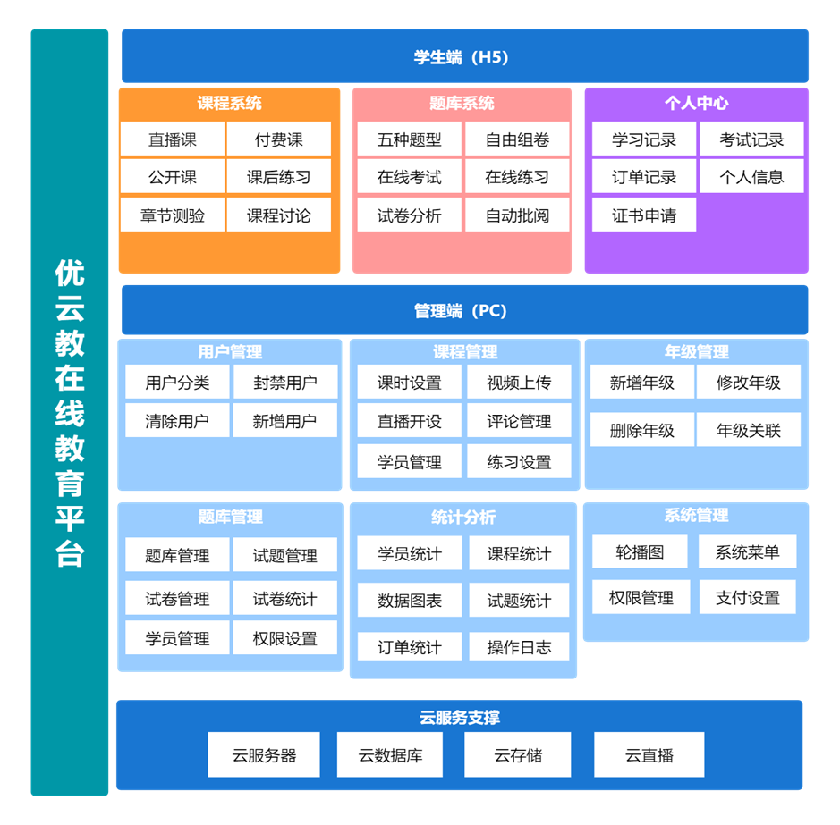
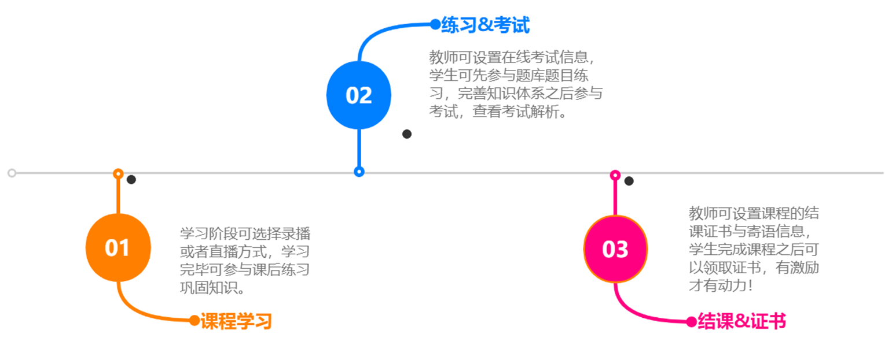
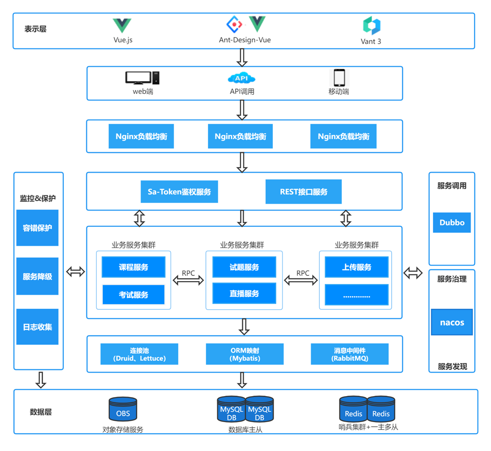
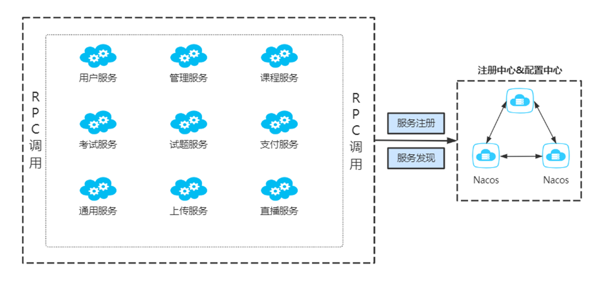

# UCloudTeach-MicroService

### 项目介绍
#### 1、项目说明
优云教是一个服务于学生、教师的在线教育平台，主要定位于学校自有教学平台的建设，提供线上教学全流程的解决方案，平台的最大特点是将日常的教学任务进行整合，将课程、练习、考试等功能集为一体，不管是教师还是学生只需要登录平台进行相关操作即可，教师可在平台上对学生的学习情况进行跟踪，提高教学质量，也实现了教学资源的统一管理，在一定程度上减少了用户的时间成本。优云教致力于解决学校在线教育自有平台缺失或者功能不完善等痛点问题，满足学校多功能教学平台定制化开发的需求，减轻自有平台构建压力，助力平台快速上线。本项目为微服务架构版本，使用 **SpringBoot+Dubbo** 搭建，已完成基于服务的拆分。

#### 2、功能介绍

#### 3、亮点与优势

① 平台学生端提供高定制化能力，可适应不同教学环境中教学任务的开展；

② 学习周期经过课程、考试、证书发放等形成闭环，教师可关注学生各环节学习情况，及时有效介入，提高教学质量，丰富教学成果；

③ 管理员在平台可上传大体积教学视频，提供分片上传与极速秒传功能；

④ 答题过程中可通过滑动切换题目，提供倒计时功能，有效提升用户体验；

⑤ 试题提供异步自动批阅功能，一定程度上减轻了教师的教学负担；

#### 项目架构

### 仓库说明
单体架构仓库地址为：[UCloudTeach-Monolithic](https://gitee.com/h0ss/ucloud-teach-monolithic)

前端-管理端使用Vue3+Ant-Design-Vue搭建，仓库地址为：[UCloudTeach-Admin](http://gitee.com/h0ss/ucloud-teach-admin)；

前端-学生端使用Vue3+Vant3搭建，仓库地址为：[UCloudTeach-Student](https://gitee.com/h0ss/ucloud-teach-student)；